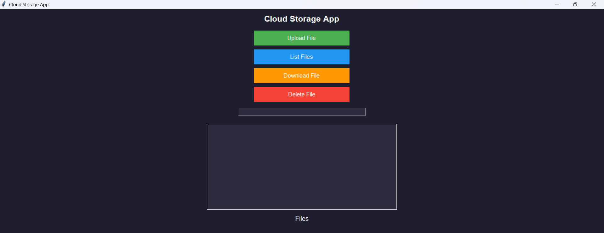
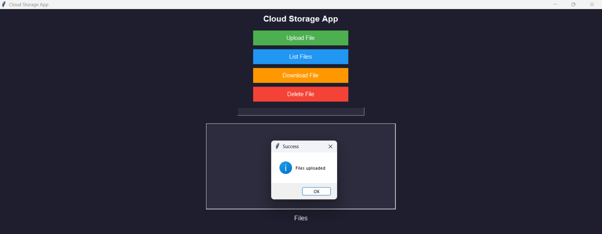
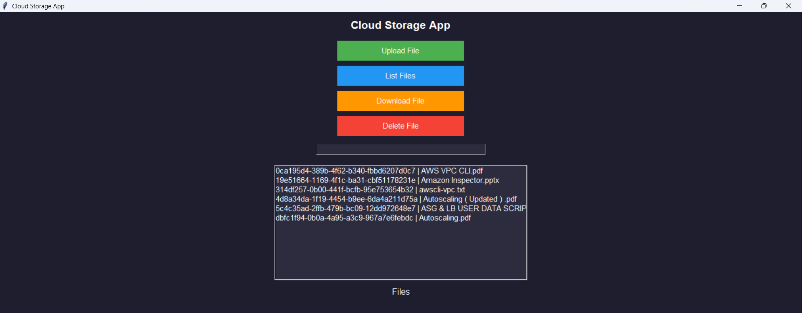
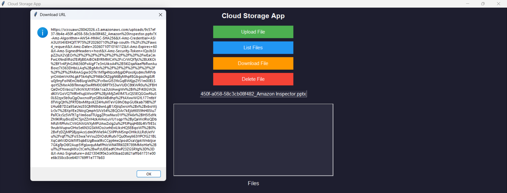
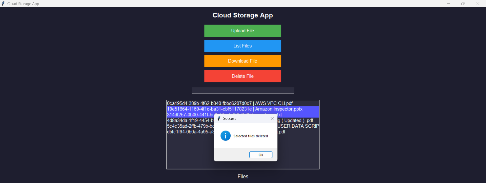
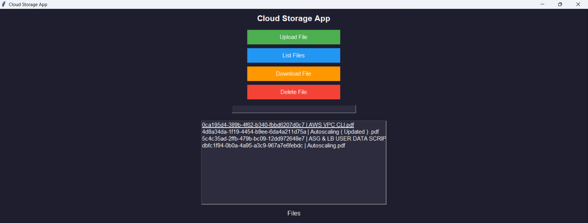

# Serverless Cloud Storage System using AWS

A desktop-based cloud storage application developed using **Python** and **AWS Serverless Services**. The application enables users to securely upload, list, download, and delete files through a **Tkinter-based desktop GUI**. It uses **Amazon S3** for file storage, **Amazon DynamoDB** for metadata management, **AWS Lambda** for backend processing, and **Amazon API Gateway** to expose REST APIs. Secure file access is implemented using **pre-signed URLs**, allowing temporary access without making the S3 bucket public.

---

## Features

- Upload multiple files
- List uploaded files
- Download files using pre-signed URLs
- Delete single or multiple files
- Secure serverless architecture
- User-friendly Tkinter GUI

---

## AWS Services

- Amazon S3
- AWS Lambda
- Amazon API Gateway
- Amazon DynamoDB
- AWS IAM

---

## Technologies

- Python
- Tkinter
- Boto3
- Requests
- REST API

---

## Project Structure

### Frontend
- **Python Tkinter (app.py)**
  - Desktop-based GUI for file management
  - Sends REST API requests using the `requests` library

### Backend
- **Amazon API Gateway** – Exposes REST APIs
- **AWS Lambda Functions**
  - Generate Upload URL
  - Save Metadata
  - List Files
  - Download File
  - Delete File

### Storage
- **Amazon S3** – Stores uploaded files
- **Amazon DynamoDB** – Stores file metadata (File ID, File Name, S3 Key)

### Security
- AWS IAM for secure permissions
- Pre-signed URLs for temporary and secure file access

---

## Architecture


---

## Screenshots

### Home Screen


### Upload Files


### List Files


### Download File


### Delete Files


### Files After Deletion


---

## Installation

```bash
pip install -r requirements.txt
python app.py
```

> **Note:** Replace the API Gateway endpoint in `app.py` with your own deployed API before running the application.

---

## Author

**Kuldeep Jangra**

B.Tech Computer Science Engineering Graduate

AWS Certified Solutions Architect – Associate (SAA-C03)

AWS Certified Cloud Practitioner (CLF-C02)
