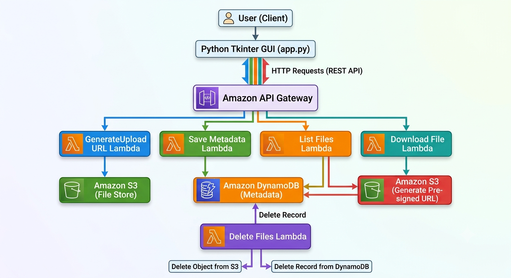

# Serverless Cloud Storage System using AWS

A desktop-based cloud storage application developed using **Python** and **AWS Serverless Services**. The application enables users to securely upload, list, download, and delete files through a Tkinter-based GUI. It uses **Amazon S3** for file storage, **Amazon DynamoDB** for metadata management, **AWS Lambda** for backend processing, and **Amazon API Gateway** to expose REST APIs. Secure access is provided using **pre-signed URLs**, ensuring temporary access to files without exposing the S3 bucket publicly.

---

## Features

- Upload multiple files
- List uploaded files
- Download files using pre-signed URLs
- Delete single or multiple files
- Secure serverless architecture
- User-friendly Tkinter GUI

---

## AWS Services

- Amazon S3
- AWS Lambda
- Amazon API Gateway
- Amazon DynamoDB
- AWS IAM

---

## Technologies

- Python
- Tkinter
- Boto3
- Requests
- REST API

---

## Architecture



---

## Screenshots

- Home Screen
- Upload Files
- List Files
- Download Files
- Delete Files

---

## Installation

```bash
pip install -r requirements.txt
python app.py
```

---

## Author

**Kuldeep Jangra**

B.Tech Computer Science Engineering

AWS Certified Solutions Architect – Associate (SAA-C03)

AWS Certified Cloud Practitioner (CLF-C02)